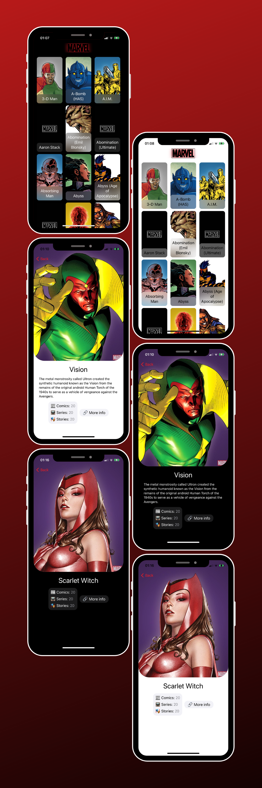

# Marvel Heroes
> App that lists Marvel heroes and shows some info about them using MARVEL API

## Requirements

- iOS 14.1+
- Xcode 12.1+

## Technologies

Developed using native frameworks:
- UIKit
- Combine

And third party:
- [SDWebImage](https://github.com/SDWebImage/SDWebImage)

## API

The app uses [MARVEL](https://developer.marvel.com/) API
